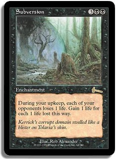
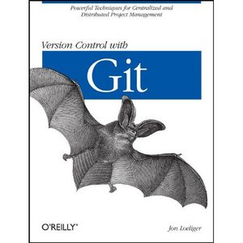
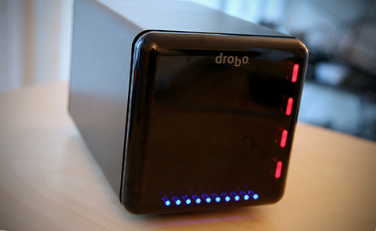
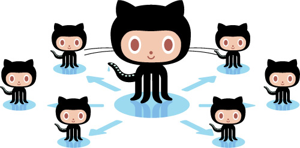

!SLIDE center

## Everyday Source Control

!SLIDE subsection
<link href='http://fonts.googleapis.com/css?family=Comfortaa:400,700' rel='stylesheet' type='text/css'>
# What is Source Control #

!SLIDE bullets incremental
* "Revision control"
* "Version control"
* "Software configuration management"

!SLIDE incremental bullets
# Wikipedia
* "The management of changes to documents, programs, and other information stored as computer files."
* *yawn*

!SLIDE
# Stuffy terms, wrong focus #

!SLIDE bullets incremental
# Our definition: #

* "Process and tools to obtain the latest code for your project, then merge and store your changes in the code repository"

!SLIDE center
# Choices

!SLIDE

# Today: Subversion

!SLIDE bullets

# Later: Git
* (We use it a lot)

!SLIDE subsection
# Significance in software development

!SLIDE incremental
# Source control is
* Pervasive, intrinsic
* Ubiquitous but varied

!SLIDE bullets incremental
# Code goes in SC.
* *Always.*

!SLIDE incremental
# Why?
* Track and document
* Collaborate
* Store and backup code

!SLIDE incremental

# Backups aren't good enough

!SLIDE

# The rest of the world

!SLIDE
# Publish

* SourceForge
* Github
* Google Code

!SLIDE incremental
# Share

* solicit input, feedback, criticism
* patches, forks, pull requests

!SLIDE subsection
# How Atomic uses source control

!SLIDE incremental bullets
# All code is in source control
* Git
* SVN 
* (still use both)

!SLIDE bullets
# All code is under CI
* (Continuous Integration)
* Watches our repositories for changes
* No SC => No CI

!SLIDE incremental bullets
# All repos available to all employees
* ...and sometimes the customer
* Web tools for discovering and exploring repos

!SLIDE incremental bullets
# Prefer command-line tools
* We want help (and power), not more work!
* (though sometimes a GUI is nice)
* Command-line is simpler (really!)

!SLIDE incremental bullets
# Always up-to-date
* You have the latest code to work on
* So should your coworkers
* ...SO CHECK IT IN!

!SLIDE incremental bullets
# Not just for "code"
* Sales proposals
* Invoices and POs
* Electronic books

!SLIDE incremental bullets
# Personal use
* We all have repos
* Intra-office collaboration (RSS!)
* Games
* Language / tool exploration

!SLIDE bullets
# Atomic OSS
* http://github.com/atomicobject
* (SourceForge / RubyForge)

!SLIDE subsection
# Subversion
## A day in the life

!SLIDE incremental bullets
# Let's skip the beginning
* SVN has 33 commands
* You care about 5 commands
* There's already a repo

!SLIDE
# Checkout -> (edit) -> Commit

!SLIDE bullets
# svn checkout #
* (svn co)

!SLIDE commandline incremental
<pre style="font-size: 24pt">
$ svn co https://svnserver/sample_proj

A    sample_proj/README.txt
A    sample_proj/Hello.java
</pre>

!SLIDE
# svn log #

!SLIDE
<pre style="font-size: 16pt">
$ svn log

------------------------------------------------------------------------
r1598 | crosby | 2011-09-20 20:27:47 -0400 (Tue, 20 Sep 2011) | 1 line

Sketched Hello.java
------------------------------------------------------------------------
r1597 | crosby | 2011-09-20 19:55:48 -0400 (Tue, 20 Sep 2011) | 1 line

Starting SVN sample for Everyday Source Control
------------------------------------------------------------------------
</pre>

!SLIDE bullets
# Edit some code
* Modify Hello.java to print the time

!SLIDE
# Hello.java
<pre style="font-size: 16pt">
class Hello {
  public static void main(String args[]) {
    System.out.println("Hello, World!");
  }
}
</pre>

!SLIDE
# Change that println to:
<pre style="font-size: 16pt">
    System.out.println("Hello, World, the time is " + new Date());
</pre>

!SLIDE bullets
# svn status
* (svn st)

!SLIDE
<pre style="font-size: 16pt">
$ svn st

M       Hello.java
</pre>

!SLIDE
# svn diff

!SLIDE
<pre style="font-size: 16pt">
$ svn diff

Index: Hello.java
===================================================================
--- Hello.java	(revision 1598)
+++ Hello.java	(working copy)
@@ -1,5 +1,7 @@
+import java.util.Date;
+
 class Hello {
   public static void main(String args[]) {
-    System.out.println("Hello, World!");
+    System.out.println("Hello, World, the time is " + new Date());
   }
 }
</pre>

!SLIDE bullets
# svn commit #
* (svn ci)

!SLIDE 
<pre style="font-size: 16pt">
$ svn ci -m "Printing current date/time along with Hello World"

Sending        Hello.java
Transmitting file data .
Committed revision 1602.
</pre>

!SLIDE bullets
# ...and you can go home.
* The CI server will build and test
* Everyone else can update to your changes

!SLIDE bullets
# But later...
* You bring down some changes from the server

!SLIDE bullets
# svn update
* (svn up)

!SLIDE
<pre style="font-size: 16pt">
$ svn up

U    Hello.java
Updated to revision 1603.
</pre>

!SLIDE
<pre style="font-size: 16pt">
$ svn log

------------------------------------------------------------------------
r1603 | crosby | 2011-09-22 00:22:34 -0400 (Thu, 22 Sep 2011) | 2 lines

Added separators above and below the hello msg

------------------------------------------------------------------------
r1602 | crosby | 2011-09-22 00:10:35 -0400 (Thu, 22 Sep 2011) | 1 line

Printing current date/time along with Hello World
------------------------------------------------------------------------
r1599 | crosby | 2011-09-20 21:14:12 -0400 (Tue, 20 Sep 2011) | 1 line

Added CHANGELOG area to README.txt
...
</pre>

!SLIDE bullets
# svn diff -rXXXX:YYYY
* Specify revisions to compare

!SLIDE
<pre style="font-size: 16pt">
$ svn diff -r 1602:1603

Index: Hello.java
===================================================================
--- Hello.java	(revision 1602)
+++ Hello.java	(revision 1603)
@@ -2,6 +2,8 @@
 
 class Hello {
   public static void main(String args[]) {
+    System.out.println("-------------------------------------------------------------------------------");
     System.out.println("Hello, World, the time is " + new Date());
+    System.out.println("-------------------------------------------------------------------------------");
   }
 }
</pre>

!SLIDE
# Append some output
<pre style="font-size: 16pt">
    ...
    System.out.println("Thanks!");
    ...
</pre>

!SLIDE
# Attempt to commit...
<pre style="font-size: 16pt">
$ svn ci -m "Added a quick thanks to the end"

Sending        Hello.java
svn: Commit failed (details follow):
svn: File or directory 'Hello.java' is out of date; try updating
svn: resource out of date; try updating
</pre>

!SLIDE
# Update to the latest code...
<pre style="font-size: 16pt">
$ svn up

Conflict discovered in 'Hello.java'.
Select: (p) postpone, (df) diff-full, (e) edit,
        (mc) mine-conflict, (tc) theirs-conflict,
        (s) show all options:
</pre>

!SLIDE
# Edit the file
## (Remove conflict markers)
<pre style="font-size: 16pt">
    System.out.println("Hello, World, the time is " + new Date());
    System.out.println("-------------------------------------------------
<<<<<<< .mine
    System.out.println("Thanks!");
=======
    System.out.println("Thank you very much.");
>>>>>>> .r1604
</pre>

!SLIDE
# Decide to keep your changes:
<pre style="font-size: 16pt">
    System.out.println("Hello, World, the time is " + new Date());
    System.out.println("-------------------------------------------------
    System.out.println("Thanks!");
</pre>

!SLIDE
# Save and exit

<pre style="font-size: 16pt">
$ svn st

?       Hello.java.mine
?       Hello.java.r1603
?       Hello.java.r1604
C       Hello.java
</pre>
  
!SLIDE bullets incremental
# Mark conflict as resolved

<pre style="font-size: 16pt">
$ svn resolved Hello.java

Resolved conflicted state of 'Hello.java

$ svn st

M       Hello.java
</pre>
* (then commit)

!SLIDE incremental bullets
# Fancy stuff?
* Branching / merging
* History visualization
* svn blame

!SLIDE incremental bullets
# (Another day)

!SLIDE subsection center

# Git
Our other first choice

!SLIDE incremental bullets
# Git Advantages
* Branch / merging heaven
* Distributed development path
* Popular, social
* FAST

!SLIDE incremental bullets
# Git = Independence
* no network
* no server
* no perms
* ...until you're ready

!SLIDE subsection
# Links

!SLIDE 
# This presentation #
## [atomicobject.github.com/source\_control](http://atomicobject.github.com/source\_control)

!SLIDE 
# SVN
* [svn book](http://svnbook.red-bean.com/en/1.6/svn-book.html)
* [svn Quick Reference Card](http://www.collab.net/community/subversion/articles/SvnQuickReferenceCard.html)

!SLIDE
# Git
* [gitready](http://gitready.com)
* [gitref](http://gitref.org)

!SLIDE
# Tools we used to build this preso: #
* [showoff](http://github.com/shacon/showoff)
* [Checkvist](http://checkvist.com)
* [Google WebFonts](http://google.com/webfonts)

!SLIDE bullets
# Thanks!
* {karlin,dave}@atomicobject.com
* need a summer internship?
* [atomicobject.com/jobs](http://atomicobject.com/jobs)
