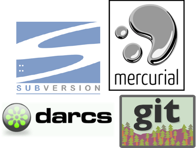

!SLIDE
<link href='http://fonts.googleapis.com/css?family=Comfortaa:400,700' rel='stylesheet' type='text/css'>
# What is Source Control #

!SLIDE bullets incremental
# Our definition: #

* "Process and tools that let you obtain the latest code for your project, then 
merge and store your updates in the code repository"

!SLIDE bullets
# Other definitions: #

* "Revision control"
* "Version control"
* "Software configuration management"

!SLIDE
# Stuffy terms, wrong focus #

!SLIDE bullets incremental
* "The management of changes to documents, programs, and other information stored as computer files."
* *yawn*

!SLIDE center

!SLIDE incremental bullets
    svn co [output]
    svn diff [output]
    svn log [output]
    svn ci [output]

!SLIDE
# Check This Code #
    @@@ Ruby
    code_here()
