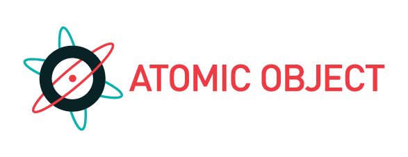

!SLIDE center

!SLIDE subsection
<link href='http://fonts.googleapis.com/css?family=Comfortaa:400,700' rel='stylesheet' type='text/css'>
# What is Source Control #

!SLIDE bullets incremental
* "Revision control"
* "Version control"
* "Software configuration management"

!SLIDE incremental bullets
# Wikipedia
* "The management of changes to documents, programs, and other information stored as computer files."
* *yawn*

!SLIDE
# Stuffy terms, wrong focus #

!SLIDE bullets incremental
# Our definition: #

* "Process and tools to obtain the latest code for your project, then merge and store your changes in the code repository"

!SLIDE center
# Choices

!SLIDE
# Subversion Samples 

!SLIDE
# svn checkout #

!SLIDE commandline incremental
<pre style="font-size: 24pt">
$ svn checkout https://svnserver/sample_proj

A    sample_proj/README.txt
A    sample_proj/Hello.java
</pre>

!SLIDE
# svn log #

!SLIDE
<pre style="font-size: 16pt">
$ svn log

------------------------------------------------------------------------
r1598 | crosby | 2011-09-20 20:27:47 -0400 (Tue, 20 Sep 2011) | 1 line

Sketched Hello.java
------------------------------------------------------------------------
r1597 | crosby | 2011-09-20 19:55:48 -0400 (Tue, 20 Sep 2011) | 1 line

Starting SVN sample for Everyday Source Control
------------------------------------------------------------------------
</pre>

!SLIDE
# svn commit #

!SLIDE 
<pre style="font-size: 16pt">
$ svn ci -m "Added CHANGELOG area to README.txt"

Sending        README.txt
Transmitting file data .
Committed revision 1599.
</pre>

!SLIDE subsection
# Significance in software development

!SLIDE incremental
# Source control is
* Pervasive, intrinsic
* Ubiquitous but varied

!SLIDE bullets incremental
# Code goes in SC.
* *Always.*

!SLIDE incremental
# Why?
* Store and backup code
* Collaborate
* Track and document

!SLIDE incremental
# Backups aren't good enough
* Time passes
* Easy for discipline to lapse
* branch / diff / merge: manual, too hard

!SLIDE
# The rest of the world

!SLIDE incremental
# Publish

* SourceForge
* Github
* Google Code

!SLIDE incremental
# Share

* solicit input, feedback, criticism
* patches, forks, pull requests

!SLIDE incremental bullets subsection
# How Atomic uses source control

!SLIDE incremental bullets
# All code is in source control
* In-house Gitorious server
* Older SVN repositories 
* (still use both systems)

!SLIDE bullets
# All code is under CI
* (Continuous Integration)
* Watches our repositories for changes
* No SC => No CI

!SLIDE incremental bullets
# All repos available to all employees
* ...and sometimes the customer
* Web tools for discovering and exploring repos

!SLIDE incremental bullets
# Prefer command-line tools
* SVN and Git have some nice GUI interfaces
* Sometimes handy for odd cases, conflicts, etc
* ...but we use these tools SO MUCH

!SLIDE incremental bullets
# Always up-to-date
* You have the latest code to work on
* ...so do your coworkers
* (Don't be stingy)
* Punching out with uncommitted code is a NO NO

!SLIDE incremental bullets
# Not just for code
* Sales proposals
* Invoices and POs
* Critical internal documents
* Electronic books

!SLIDE incremental bullets
# Personal use
* We all have repos
* Intra-office collaboration (RSS!)
* Games
* Language / tool exploration

!SLIDE bullets
# Atomic OSS
* http://github.com/atomicobject
* (SourceForge / RubyForge)

!SLIDE subsection
# Subversion
## A day in the life

!SLIDE
# svn st #

!SLIDE
# svn up #

!SLIDE 
# (edit code) #

!SLIDE 
# svn diff #

!SLIDE 
# svn up (again) #

!SLIDE 
# svn commit -m#

!SLIDE 
# svn up (later) #
* Nice clean merge

!SLIDE 
# svn up (more later) #
* Conflicts

!SLIDE 
# Conflict Resolution #
* Look for conflict markers
* Edit code
* Commit

!SLIDE incremental bullets
# Fancy stuff?
* Branching
* History
* Revert

!SLIDE incremental bullets
# (Not today)

!SLIDE subsection
# Git
* Our other first choice

!SLIDE subsection
# Git Advantages
* 

!SLIDE subsection
# Git = Independence
* no network, no server, no perms

!SLIDE 
# This presentation #
## atomicobject.github.com/source\_control

!SLIDE
# SVN Command ref / tutorials #

!SLIDE
# Git ref / tutorials #
* TODO

!SLIDE
# Tools we used to build this preso: #
* github.com/shacon/showoff
* checkvist.com
* google.com/webfonts

!SLIDE
# Thanks!
* atomicobject.com/jobs
